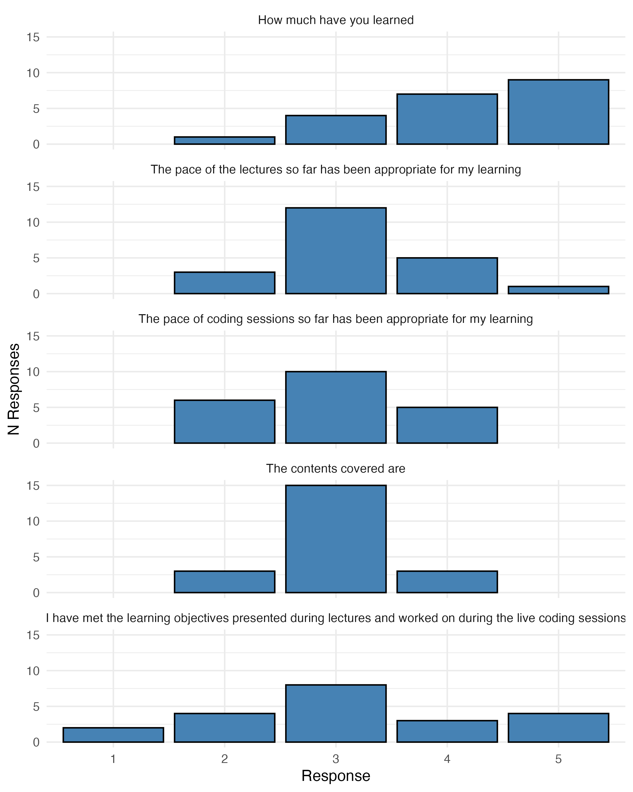
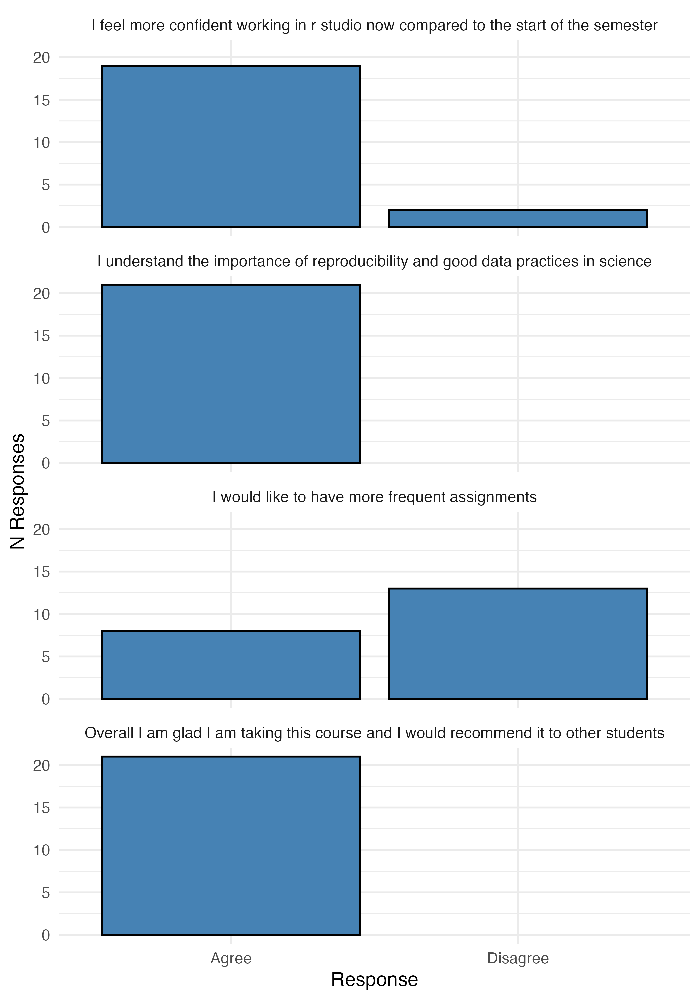

# Evaluating survey responses

This repository serves two purposes. First, as an example for your second assignment on
data management and transformation. And second, to provide the results from the
mid-term feedback you provided.

## Repository structure

The repository contains three main folder:

- `data`:
  - `data/raw` contains the `*.csv` file as downloaded from google forms.
  - `data/processed` contains the cleaned up version of my data
- `scripts`
  - `scripts/01_processing` contains a single script that reads the raw data, cleans it up, and exports processed data.
  - `scripts/02_analyses` 
  - `scripts/03_contents` contains a single script that builds two figures, shown below
- `results` contains a folder with images

